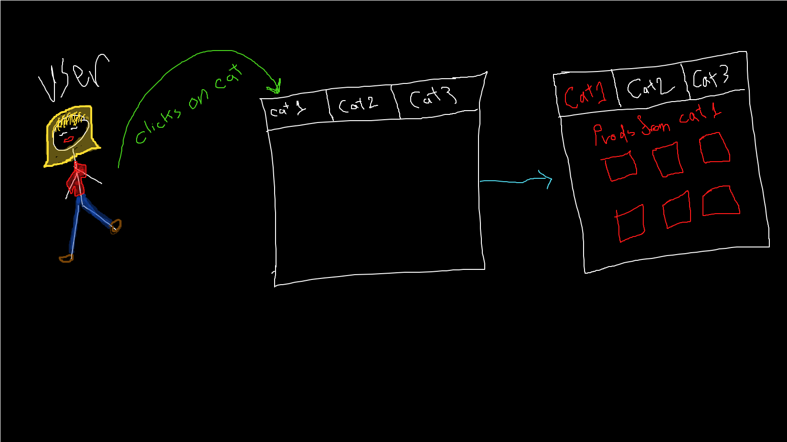

# LAB - Class 38

# storefront

### Author: Muhammed Tommalieh & Darah

### Links and Resources

- [submission PR](https://github.com/401-advanced-javascript-tommalieh/storefront/pull/4)

#### How to initialize/run your application

- e.g. `npm start`

#### UML

